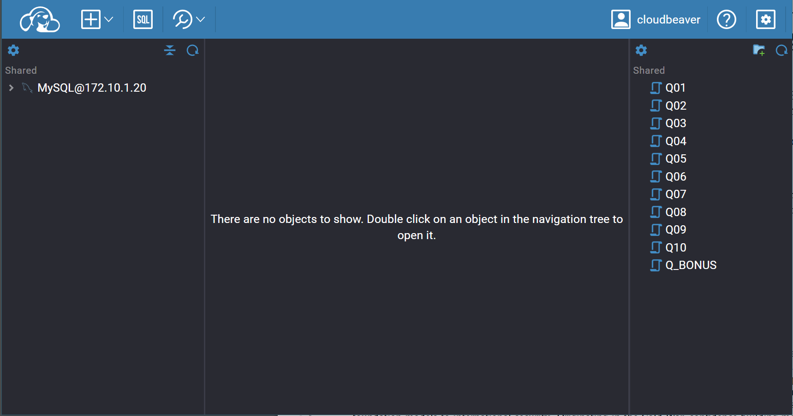

# Danny's Diner case study

[Case study description](https://8weeksqlchallenge.com/case-study-1/)

## Details

The data is loaded into a MySQL database running in a docker container. The queries are written in CloudBeaver (a cloud IDE) running in another docker container.

The containers are configured to load the data at initialization in the database.

## Scripts

1. [What is the total amount each customer spent at the restaurant?](cb_workspace/GlobalConfiguration/Q01.sql)

2. [How many days has each customer visited the restaurant?](cb_workspace/GlobalConfiguration/Q02.sql)

3. [What was the first item from the menu purchased by each customer?](cb_workspace/GlobalConfiguration/Q03.sql)

4. [What is the most purchased item on the menu and how many times was it purchased by all customers?](cb_workspace/GlobalConfiguration/Q04.sql)

5. [Which item was the most popular for each customer?](cb_workspace/GlobalConfiguration/Q05.sql)

6. [Which item was purchased first by the customer after they became a member?](cb_workspace/GlobalConfiguration/Q06.sql)

7. [Which item was purchased just before the customer became a member?](cb_workspace/GlobalConfiguration/Q07.sql)

8. [What is the total items and amount spent for each member before they became a member?](cb_workspace/GlobalConfiguration/Q08.sql)

9. [If each $1 spent equates to 10 points and sushi has a 2x points multiplier - how many points would each customer have?](cb_workspace/GlobalConfiguration/Q09.sql)

10. [In the first week after a customer joins the program (including their join date) they earn 2x points on all items, not just sushi - how many points do customer A and B have at the end of January?](cb_workspace/GlobalConfiguration/Q10.sql)

11. [Bonus question](cb_workspace/GlobalConfiguration/Q_BONUS.sql)

## How to start

- Step 1
  
  ```terminal
  docker compose up -d
  ```

- Step 2
  Head over to [http://localhost:8080]()

- Step 3
  Click on `Settings` icon at the top left corner and choose *login*

- Step 4
  Use the credentials
  
  ```
    username: cloudbeaver
    password: 1
  ```



## How to stop

```terminal
docker compose down
```
