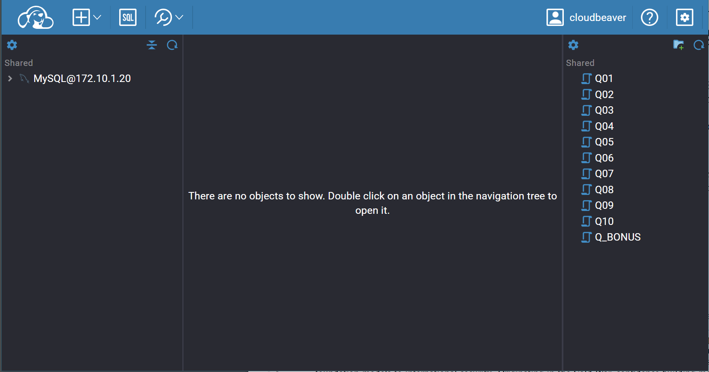

# Pizza Runner case study

[Case study description](https://8weeksqlchallenge.com/case-study-2/)

## Data

The data in the tables `customer_orders` and `runner_orders` requires a significant cleaning. 

My solution is to create a cleaned up `VIEW` of those tables.

## Details

The data is loaded into a MySQL database running in a docker container. The queries are written in CloudBeaver (a cloud IDE) running in another docker container.

The containers are configured to load the data at initialization in the database.

## Scripts

All scripts are [here](cb_workspace/GlobalConfiguration/)

### 1️⃣ Clean up scripts - create views

* [Clean up *runner_orders*](cb_workspace/GlobalConfiguration/00_cleanup_runner_orders.sql)

* [Clean up *customer_orders*](cb_workspace/GlobalConfiguration/01_cleanup_customer_orders.sql)

* [Clean up *pizza_recipes*](cb_workspace/GlobalConfiguration/02_cleanup_pizza_recipes.sql)

### 2️⃣ Pizza Metrics

* [How many pizzas were ordered?](cb_workspace/GlobalConfiguration/Pizza_Metrics_Q01.sql)

* [How many unique customer orders were made?](cb_workspace/GlobalConfiguration/Pizza_Metrics_Q02.sql)

* [How many successful orders were delivered by each runner?](cb_workspace/GlobalConfiguration/Pizza_Metrics_Q03.sql)

* [How many of each type of pizza was delivered?](cb_workspace/GlobalConfiguration/Pizza_Metrics_Q04.sql)

* [How many Vegetarian and Meatlovers were ordered by each customer?](cb_workspace/GlobalConfiguration/Pizza_Metrics_Q05.sql)

* [What was the maximum number of pizzas delivered in a single order?](cb_workspace/GlobalConfiguration/Pizza_Metrics_Q06.sql)

* [For each customer, how many delivered pizzas had at least 1 change and how many had no changes?](cb_workspace/GlobalConfiguration/Pizza_Metrics_Q07.sql)

* [How many pizzas were delivered that had both exclusions and extras?](cb_workspace/GlobalConfiguration/Pizza_Metrics_Q08.sql)

* [What was the total volume of pizzas ordered for each hour of the day?](cb_workspace/GlobalConfiguration/Pizza_Metrics_Q09.sql)

* [What was the volume of orders for each day of the week?](cb_workspace/GlobalConfiguration/Pizza_Metrics_Q10.sql)

### 3️⃣ Runner and Customer Experience

* [How many runners signed up for each 1 week period? (i.e. week starts 2021-01-01)](cb_workspace/GlobalConfiguration/Runner_and_Customer_Experience_Q01.sql)

* [What was the average time in minutes it took for each runner to arrive at the Pizza Runner HQ to pickup the order?](cb_workspace/GlobalConfiguration/Runner_and_Customer_Experience_Q02.sql)

* [Is there any relationship between the number of pizzas and how long the order takes to prepare?](cb_workspace/GlobalConfiguration/Runner_and_Customer_Experience_Q03.sql)

* [What was the average distance travelled for each customer?](cb_workspace/GlobalConfiguration/Runner_and_Customer_Experience_Q04.sql)

* [What was the difference between the longest and shortest delivery times for all orders?](cb_workspace/GlobalConfiguration/Runner_and_Customer_Experience_Q05.sql)

* [What was the average speed for each runner for each delivery and do you notice any trend for these values?](cb_workspace/GlobalConfiguration/Runner_and_Customer_Experience_Q06.sql)

* [What is the successful delivery percentage for each runner?](cb_workspace/GlobalConfiguration/Runner_and_Customer_Experience_Q07.sql)

### 4️⃣ Ingredient Optimization

* [What are the standard ingredients for each pizza?](cb_workspace/GlobalConfiguration/Ingredient_Optimisation_Q01.sql)
* [What was the most commonly added extra?](cb_workspace/GlobalConfiguration/Ingredient_Optimisation_Q02.sql)
* [What was the most common exclusion?](cb_workspace/GlobalConfiguration/Ingredient_Optimisation_Q03.sql)
* [Generate an order item for each record in the customers_orders table in the format of one](cb_workspace/GlobalConfiguration/Ingredient_Optimisation_Q04.sql) of the following:
  * Meat Lovers
  * Meat Lovers - Exclude Beef
  * Meat Lovers - Extra Bacon
  * Meat Lovers - Exclude Cheese, Bacon - Extra Mushroom, Peppers
* [Generate an alphabetically ordered comma separated ingredient list for each pizza order from the customer_orders table and add a 2x in front of any relevant ingredients](cb_workspace/GlobalConfiguration/Ingredient_Optimisation_Q05.sql) For example: "Meat Lovers: 2xBacon, Beef, ... , Salami"

## How to start

- Step 1
  
  ```terminal
  docker compose up -d
  ```

- Step 2
  Head over to [http://localhost:8080]()

- Step 3
  Click on `Settings` icon at the top left corner and choose login 

- Step 4
  Use the credentials 
  
  ```
    username: cloudbeaver
    password: 1
  ```



## How to stop

```terminal
docker compose down
```
